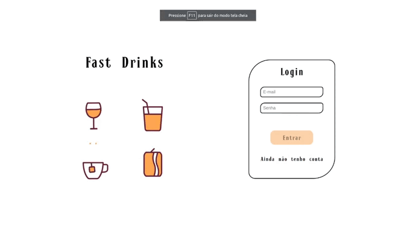

# :beer: Fast Drink :motor_scooter:

É um site de delivery completo, através dessa aplicação o usuário como cliente é capaz de:

- Fazer login e se cadastrar;
- Buscar por bebidas;
- E realizar pedido;

O usuario como vendedor é capaz de:

- Realizar venda;
- Finalizar pedido;
- Verificar se o pedido está em andamento ou nao;

O usuario como administrador do sistema:

- Cadastrar novos usuarios;
- Colocar usuarios como vendedor ou retira-los;

  
<strong>Rodando Localmente</strong>
 

   - **Instale as dependencias:** com `npm install` e depois rode o `npm start` ou `npm run dev` 

  - **:warning: Atenção:**  O procedimento acima deve ser realizado dentro da pasta Back-end e dentro da pasta Front-end, nessa ordem!
  
  - **:warning: Atenção:** Não rode o comando npm audit fix!

  - **✨ Dica:** Para rodar o projeto desta forma, obrigatoriamente você deve ter o `node` instalado em seu computador.
  
   

# 📄 Sobre

Projeto desenvolvido por _[Rodrigo Sena](https://github.com/RodrigoSen4)_,
_[Daniel Cavalcanti](https://github.com/DanielCavalcantih)_,
_[Henos Vinicius](https://github.com/Henos19)_,
_[Cristiane Dutra](https://www.linkedin.com/in/cristiane-dutra/)_,
_[Mariana](https://www.linkedin.com/in/mariana-fernanda/)_,

  

    
  

# 🛠 Ferramentas & Metodologias Utilizadas

## Aplicação Full Stack

- JavaScript ES6+;
- React;
- React Router;
- ContextAPI;
- Hooks;
- Jest e React Testing Library - Testes;
- Sinon Chai;
- MySQL;
- TDD (Test Driven Development) - Desenvolvimento Orientado por Testes.
